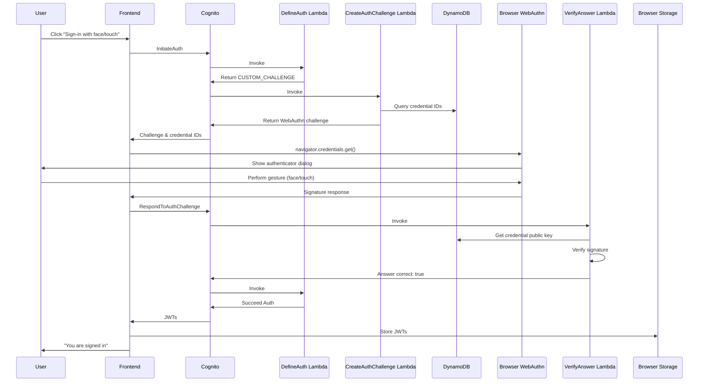
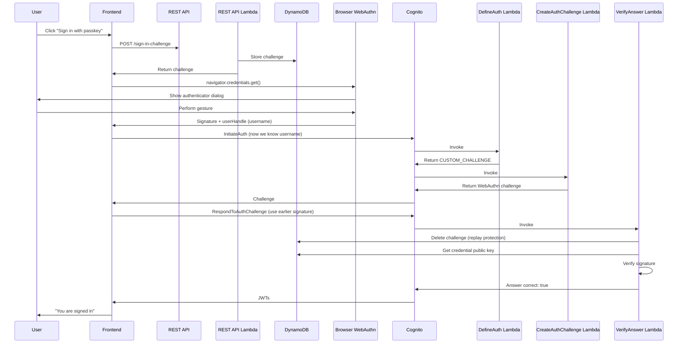
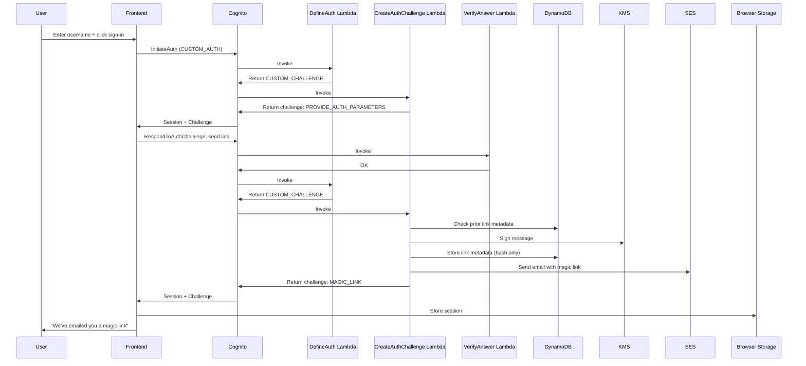
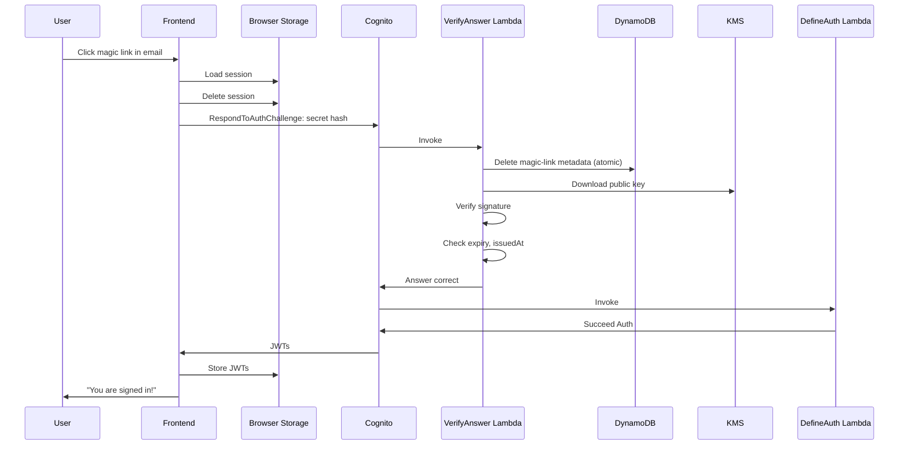
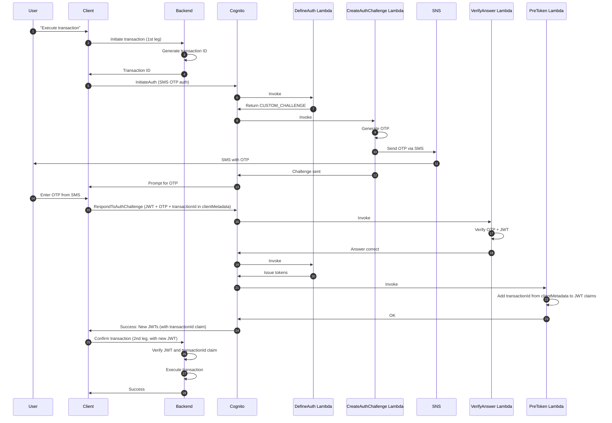

# Authentication Reference Architecture

This document serves as a comprehensive reference guide for implementing passwordless authentication patterns using Amazon Cognito. It's based on the AWS solution: [amazon-cognito-passwordless-auth](https://github.com/aws-samples/amazon-cognito-passwordless-auth).

> **NOTE**: Amazon Cognito launched native Passwordless support in November 2024. However, this reference provides additional patterns and customization options not yet available natively.

## 📋 Table of Contents

1. [Overview](#overview)
2. [Authentication Methods](#authentication-methods)
3. [FIDO2/WebAuthn Architecture](#fido2webauthn-architecture)
4. [Magic Links Architecture](#magic-links-architecture)
5. [SMS OTP Step-Up Architecture](#sms-otp-step-up-architecture)
6. [Implementation Guide](#implementation-guide)
7. [Security Best Practices](#security-best-practices)
8. [Reference Links](#reference-links)

## Overview

### What is Passwordless Authentication?

Passwordless authentication eliminates the need for users to remember and type passwords. Instead, it uses:

- **Something you have** (device, security key)
- **Something you are** (biometrics: face, fingerprint)
- **Something you know** (but not a password - e.g., a magic link)

### Supported Methods in This Solution

1. **FIDO2/WebAuthn** - Sign in with Face, Touch, YubiKey, or Passkeys
2. **Magic Links** - One-time-use secret links sent via email
3. **SMS OTP Step-Up** - SMS verification for already authenticated users

### Solution Components

The solution provides:

- **AWS CDK TypeScript** infrastructure code
- **Frontend libraries** for Web, React, and React Native
- **Prebuilt React components** for quick integration
- **Custom AWS Lambda authentication triggers**
- **DynamoDB tables** for credential and challenge storage

---

## Authentication Methods

### Method Comparison

| Feature          | FIDO2/WebAuthn | Magic Links  | SMS OTP Step-Up   |
| ---------------- | -------------- | ------------ | ----------------- |
| Usernameless     | ✓ (Passkeys)   | ✗            | ✗                 |
| Cross-browser    | Limited        | ✓            | ✓                 |
| Device binding   | ✓              | ✗            | ✗                 |
| Network required | ✗              | ✓            | ✓                 |
| Setup time       | Medium         | Instant      | Instant           |
| Use case         | Primary auth   | Primary auth | Secondary/Step-up |

---

## FIDO2/WebAuthn Architecture

### Overview

FIDO2 (Fast Identity Online 2) is a passwordless authentication standard that uses public-key cryptography. Users authenticate with biometric or security key authenticators.

### Key Features

- **Discoverable Credentials (Passkeys)**: Sign in without username
- **Non-discoverable FIDO2**: Sign in with username + authenticator
- **Credential Management**: Add/update/delete authenticators via REST API
- **Challenge-Response**: Secure cryptographic verification

### Reference Code

**Key Implementation Files**

- [signInWithFIDO2.ts](https://github.com/aws-samples/amazon-cognito-passwordless-auth/blob/main/client/src/signInWithFIDO2.ts) - Main FIDO2 sign-in logic
- [registerAuthenticator.ts](https://github.com/aws-samples/amazon-cognito-passwordless-auth/blob/main/client/src/registerAuthenticator.ts) - Credential registration
- [FIDO2.md](https://github.com/aws-samples/amazon-cognito-passwordless-auth/blob/main/FIDO2.md) - Complete architecture guide with diagrams

### AWS Architecture

```
User Device
    ↓ (navigator.credentials.create/get)
    ↓
Browser WebAuthn API
    ↓
Frontend Library (Web/React/React Native)
    ↓
REST API (HTTP API + Lambda)
    ├→ POST /sign-in-challenge (public, for passkeys)
    ├→ POST /create-credential (protected)
    ├→ PUT /credential/{id} (protected)
    └→ DELETE /credential/{id} (protected)
    ↓
AWS Lambda (Custom Auth Triggers)
    ├→ DefineAuth Lambda
    ├→ CreateAuthChallenge Lambda
    └→ VerifyAnswer Lambda
    ↓
DynamoDB
    ├→ FIDO2 Credentials Table
    ├→ Challenges Table
    └→ User Metadata
    ↓
Amazon Cognito User Pool
    ↓
JWT Tokens
```

### Registration Flow (With Username)

1. User signs in via Magic Link (or other method)
2. User clicks "Enable Face/Touch sign-in"
3. Frontend calls `POST /create-credential` with JWT
4. Lambda generates challenge and stores in DynamoDB
5. Frontend calls `navigator.credentials.create()`
6. User performs biometric/security key gesture
7. Frontend sends credential public key to `POST /complete-credential`
8. Lambda verifies and stores credential in DynamoDB

### Sign-In Flow (With Username)



### Sign-In Flow (Passkeys - Usernameless)

**Key Difference**: WebAuthn interaction happens BEFORE Cognito InitiateAuth



### Important: Username Requirements for Passkeys

Usernameless FIDO2 authentication requires **opaque usernames** (UUIDs):

- ✓ **Opaque usernames** (e.g., UUID): Passkeys supported
- ✓ **Email/phone sign-in only**: Cognito generates opaque username
- ✗ **Readable usernames** (e.g., `johndoe`): Passkeys NOT supported

### Browser Support

| Browser | Support    | Notes                                         |
| ------- | ---------- | --------------------------------------------- |
| Chrome  | ✓✓ Best    | Full WebAuthn support                         |
| Safari  | ✓ Good     | iOS 16.3+, some limitations on older versions |
| Edge    | ✓ Good     | Similar to Chrome                             |
| Firefox | ⚠️ Limited | Limited security key support (improving)      |

---

## Magic Links Architecture

### Overview

Magic Links are one-time-use secret links sent via email. Users click the link to sign in without passwords.

### Key Features

- **One-time Use**: Links expire after use
- **Cross-browser**: Works anywhere user has email access
- **Cryptographic Signing**: Uses KMS asymmetric keys (no OTP storage needed)
- **Rate Limiting**: Minimum 1 minute between requests
- **No Sensitive Data**: Only hashes stored in DynamoDB

### Reference Code

**Key Implementation Files**

- [signInWithMagicLink.ts](https://github.com/aws-samples/amazon-cognito-passwordless-auth/blob/main/client/src/signInWithMagicLink.ts) - Magic link initiation
- [completeMagicLinkSignIn.ts](https://github.com/aws-samples/amazon-cognito-passwordless-auth/blob/main/client/src/completeMagicLinkSignIn.ts) - Magic link completion
- [magicLinkResponseHandler.ts](https://github.com/aws-samples/amazon-cognito-passwordless-auth/blob/main/client/src/magicLinkResponseHandler.ts) - URL parameter parsing
- [MAGIC-LINKS.md](https://github.com/aws-samples/amazon-cognito-passwordless-auth/blob/main/MAGIC-LINKS.md) - Complete architecture guide with flow diagrams

### AWS Architecture

```
User Email
    ↓
Amazon SES
    ↓
User Browser
    ↓
Frontend Library
    ↓
Amazon Cognito (Custom Auth Flow)
    ├→ DefineAuth Lambda
    ├→ CreateAuthChallenge Lambda
    ├→ VerifyAnswer Lambda
    ↓
AWS Services
    ├→ AWS KMS (asymmetric key for signing)
    ├→ DynamoDB (challenge storage)
    ├→ Amazon SES (email)
    ↓
JWT Tokens
```

### Request Magic Link Flow



### Complete Sign-In Flow (Same Browser, New Tab)



### Complete Sign-In Flow (Different Browser)

Similar to above, but without pre-existing session. User must initiate new auth with InitiateAuth first.

### Magic Link Security

- **Signed by KMS**: Uses asymmetric signing (cannot forge without private key)
- **One-time Use**: Metadata is atomically deleted after verification
- **Rate Limiting**: Minimum 1 minute between requests per user
- **No User Info in Link**: Only cryptographic signature
- **Expiration**: Configurable (typically 15 minutes)

---

## SMS OTP Step-Up Architecture

### Overview

SMS OTP Step-Up allows authenticated users to verify their identity again without full re-authentication.

### Key Features

- **JWT Verification**: Requires valid JWT (user already signed in)
- **SMS Delivery**: Uses Amazon SNS
- **Transaction Binding**: Supports tying auth to specific operations
- **Custom Claims**: Can add transaction ID to JWT

### Reference Code

**Key Implementation Files**

- [signInWithSmsOtp.ts](https://github.com/aws-samples/amazon-cognito-passwordless-auth/blob/main/client/src/signInWithSmsOtp.ts) - SMS OTP step-up initiation
- [completeSmsOtpSignIn.ts](https://github.com/aws-samples/amazon-cognito-passwordless-auth/blob/main/client/src/completeSmsOtpSignIn.ts) - SMS OTP step-up completion
- [SMS-OTP-STEPUP.md](https://github.com/aws-samples/amazon-cognito-passwordless-auth/blob/main/SMS-OTP-STEPUP.md) - Complete architecture guide with flow diagrams

### AWS Architecture

```
Authenticated User
    ↓
Client Application
    ↓
Backend Service (1st Leg)
    ├→ Generate transaction ID
    ├→ Store transaction metadata
    ↓
Frontend initiates SMS OTP Auth
    ↓
Amazon Cognito (Custom Auth Flow)
    ├→ DefineAuth Lambda
    ├→ CreateAuthChallenge Lambda
    ├→ VerifyAnswer Lambda
    ├→ PreToken Lambda (adds transaction ID to JWT)
    ↓
AWS Services
    ├→ DynamoDB (OTP storage)
    ├→ Amazon SNS (SMS)
    ├→ AWS Lambda (JWT verification)
    ↓
Backend Service (2nd Leg)
    └→ Verify JWT + transaction ID
    └→ Execute transaction
```

### 2-Legged Transaction Flow



### Security Considerations

- **JWT Validation**: `aws-jwt-verify` library validates JWT structure and expiration
- **Transaction ID**: Ties auth to specific operation
- **Claim Injection**: PreToken trigger adds transaction context to JWT
- **Backend Validation**: Backend must verify JWT before executing operation

---

## Implementation Guide

### Prerequisites

- AWS Account
- Node.js >=22
- TypeScript knowledge
- AWS CDK knowledge (v2)

### Reference Code for Implementation

**Backend (CDK Infrastructure)**

- [CDK Construct](https://github.com/aws-samples/amazon-cognito-passwordless-auth/tree/main/cdk) - CDK stack definition
- [Lambda Triggers (DefineAuth, CreateAuthChallenge, VerifyAnswer, etc)](https://github.com/aws-samples/amazon-cognito-passwordless-auth/tree/main/cdk/lib/lambdas) - Custom auth flow implementation

**Frontend (Web/React/React Native)**

- [Web/Plain JavaScript](https://github.com/aws-samples/amazon-cognito-passwordless-auth/tree/main/client) - Core client implementation
- [React Hooks](https://github.com/aws-samples/amazon-cognito-passwordless-auth/tree/main/client/react) - React-specific hooks and utilities
- [React Components](https://github.com/aws-samples/amazon-cognito-passwordless-auth/tree/main/client/react/components) - Prebuilt credential management UI

## Quick Reference: Feature Comparison

### When to Use Each Method

#### ✅ Use FIDO2/WebAuthn for:

- Primary authentication
- High security requirements
- Mobile apps with biometrics
- Reducing password reuse

#### ✅ Use Magic Links for:

- Fast sign-up/sign-in
- Email-based workflows
- Cross-device authentication
- Fallback when FIDO2 unavailable

#### ✅ Use SMS OTP Step-Up for:

- Sensitive operations (transactions)
- Account recovery
- Administrative actions
- Additional verification

## Troubleshooting

### FIDO2 Issues

**Problem**: WebAuthn not supported in browser

- **Solution**: Check browser compatibility table above. Use Chrome for best support.

**Problem**: Passkeys not working (usernameless)

- **Solution**: Verify username is opaque (UUID). Readable usernames don't support passkeys.

### Magic Link Issues

**Problem**: Email not received

- **Solution**: Check SES is verified for sending domain. Check spam folder. Verify SES isn't in sandbox.

**Problem**: Link expires too quickly

- **Solution**: Increase expiration time in CDK construct configuration.

### SMS OTP Issues

**Problem**: SMS not received

- **Solution**: Verify SNS is configured in correct region. Check phone number format.

**Problem**: "JWT invalid" error

- **Solution**: Ensure user has valid, non-expired JWT before initiating step-up.
