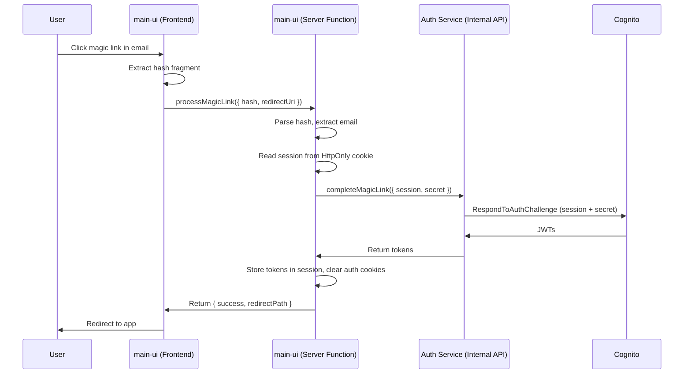
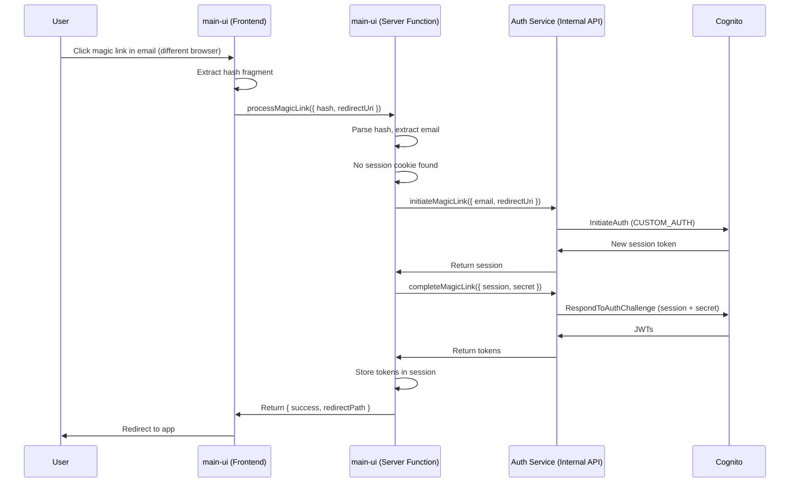
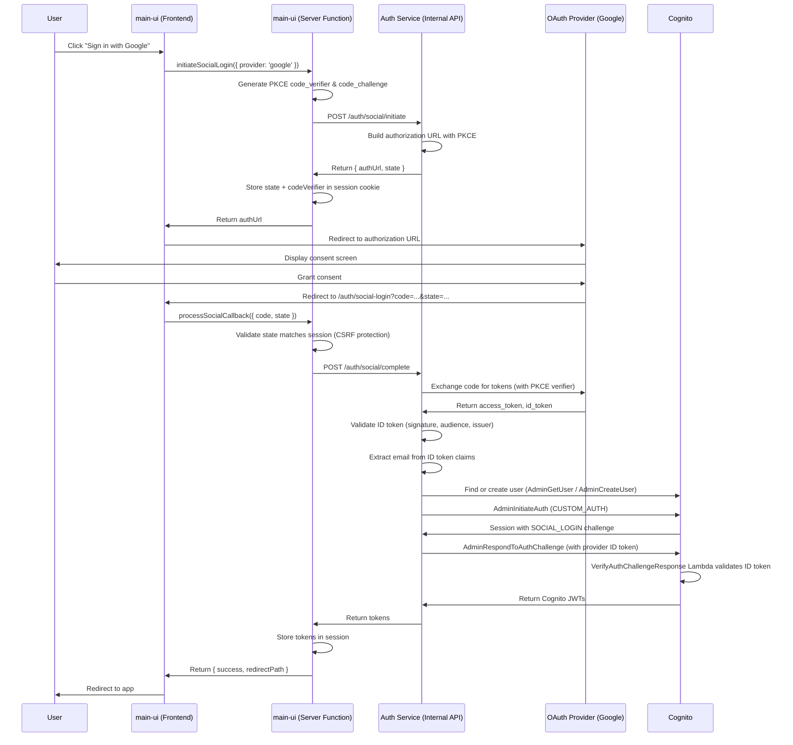

# Authentication Architecture

Comprehensive guide to the authentication architecture, design decisions, and implementation patterns used in this monorepo.

## Table of Contents

- [Overview](#overview)
- [Architecture Principles](#architecture-principles)
- [System Design](#system-design)
- [Service Communication](#service-communication)
- [Infrastructure Patterns](#infrastructure-patterns)
- [Security Model](#security-model)
- [Social Login](#social-login)
- [Client-Side Session Management](#client-side-session-management)
- [Related Documentation](#related-documentation)

## Overview

The authentication system is built on **service encapsulation** and **API-first design** principles. Services communicate through type-safe internal APIs, with implementation details (like Cognito) hidden behind clean service boundaries.

### Key Design Principles

1. **Encapsulation**: Auth service owns and manages all authentication concerns
2. **API-First**: Services interact via type-safe ORPC contracts, not direct resource access
3. **Single Responsibility**: Each service has one clear purpose
4. **Loose Coupling**: Services depend on APIs, not implementation details
5. **Type Safety**: End-to-end type safety from contract to implementation

## Architecture Principles

### Service Boundaries

```
┌─────────────────────────────────────────────────────────────┐
│                        Auth Service                          │
│  ┌─────────────────────────────────────────────────────┐    │
│  │  Internal Implementation (Cognito, KMS, DynamoDB)   │    │
│  │  - User Pool configuration                          │    │
│  │  - Magic Link signing/verification                  │    │
│  │  - Custom Lambda triggers                           │    │
│  └─────────────────────────────────────────────────────┘    │
│                          ▼                                   │
│  ┌─────────────────────────────────────────────────────┐    │
│  │           Public Internal API (ORPC)                │    │
│  │  - POST /auth/login                                 │    │
│  │  - POST /auth/verify                                │    │
│  │  - GET /auth/user/{id}                              │    │
│  └─────────────────────────────────────────────────────┘    │
└─────────────────────────────────────────────────────────────┘
                          ▲
                          │ Type-safe ORPC calls
                          │
┌─────────────────────────────────────────────────────────────┐
│                    Consumer Services                         │
│  (main-ui, mobile-app, etc.)                                │
│                                                              │
│  - Only knows AUTH_INTERNAL_API_URL                         │
│  - Uses @contract/internal-api/auth for type safety         │
│  - No direct Cognito access                                 │
└─────────────────────────────────────────────────────────────┘
```

### Why This Design?

**Before (Tight Coupling):**

```typescript
// Consumer needs to know about Cognito
environment: {
  COGNITO_USER_POOL_ID: userPoolId,
  COGNITO_CLIENT_ID: clientId,
  COGNITO_CLIENT_SECRET: clientSecret, // ❌ Secrets leaked across services
}

// Consumer must implement Cognito SDK calls
import { CognitoIdentityProviderClient } from '@aws-sdk/client-cognito-identity-provider';
```

**After (Loose Coupling):**

```typescript
// Consumer only needs API URL
environment: {
  AUTH_INTERNAL_API_URL: authApiUrl, // ✅ Single endpoint
}

// Consumer uses type-safe API client
import { client } from '~/internal-api/auth';
const user = await client.user.get({ id }); // ✅ Type-safe, simple
```

### Benefits

| Aspect              | Benefit                                            |
| ------------------- | -------------------------------------------------- |
| **Security**        | Secrets stay within auth service, not distributed  |
| **Maintainability** | Change Cognito to Auth0? Only auth service changes |
| **Testability**     | Mock API instead of mocking AWS SDK                |
| **Type Safety**     | Contracts ensure API compatibility                 |
| **Independence**    | Services deploy independently                      |

## System Design

### Component Overview

```
┌──────────────────────────────────────────────────────────────┐
│                    Shared Infrastructure                      │
│  ┌────────────────────────────────────────────────────┐      │
│  │  Internal API Gateway (HTTP API v2)                │      │
│  │  - IAM authorization                               │      │
│  │  - Service-to-service communication                │      │
│  └────────────────────────────────────────────────────┘      │
│                                                               │
│  Published via SSM:                                          │
│  - shared-infra/internal-api-id                             │
│  - shared-infra/internal-api-url                            │
└──────────────────────────────────────────────────────────────┘
                          ▲
                          │ Adds routes
┌──────────────────────────────────────────────────────────────┐
│                      Auth Service                             │
│  ┌────────────────────────────────────────────────────┐      │
│  │  Infrastructure (infra/)                           │      │
│  │  ├── UserPool - Cognito configuration              │      │
│  │  ├── CognitoTriggers - Lambda auth flow handlers   │      │
│  │  └── MagicLink - KMS, DynamoDB, SES resources      │      │
│  └────────────────────────────────────────────────────┘      │
│  ┌────────────────────────────────────────────────────┐      │
│  │  Lambda Functions (functions/)                     │      │
│  │  ├── internal-api/ - ORPC router implementation    │      │
│  │  └── cognito/ - Custom auth triggers               │      │
│  └────────────────────────────────────────────────────┘      │
│                                                               │
│  Published via SSM:                                          │
│  - auth/internal-api-url (full URL with /auth prefix)       │
└──────────────────────────────────────────────────────────────┘
                          ▲
                          │ Consumes
┌──────────────────────────────────────────────────────────────┐
│                    Consumer Service (e.g., main-ui)           │
│  ┌────────────────────────────────────────────────────┐      │
│  │  Application (app/)                                │      │
│  │  ├── internal-api/auth.ts - ORPC client            │      │
│  │  └── server/ - Server functions using client       │      │
│  └────────────────────────────────────────────────────┘      │
│                                                               │
│  Reads from SSM:                                             │
│  - auth/internal-api-url                                     │
└──────────────────────────────────────────────────────────────┘
```

### Deployment Flow

1. **shared-infra** deploys first:
   - Creates HTTP API Gateway
   - Writes `internal-api-id` and `internal-api-url` to SSM

2. **auth** deploys second (depends on shared-infra):
   - Reads `internal-api-id` from SSM
   - Adds routes: `ANY /auth/{proxy+}` → Lambda handler
   - Creates Cognito User Pool, KMS keys, DynamoDB tables
   - Writes `auth/internal-api-url` to SSM (full URL: `https://xxx.execute-api.region.amazonaws.com/auth`)

3. **main-ui** deploys last (depends on auth):
   - Reads `auth/internal-api-url` from SSM
   - Passes URL to Nitro SSR server as environment variable
   - Server functions create ORPC client and make type-safe calls

### Dependency Chain

```
shared-infra (no dependencies)
    ↓
auth (depends on @infra/shared-infra)
    ↓
main-ui (depends on @infra/auth)
```

**Declared in `package.json`:**

```json
// services/auth/package.json
{
  "dependencies": {
    "@infra/shared-infra": "workspace:*"
  }
}

// services/main-ui/package.json
{
  "dependencies": {
    "@infra/auth": "workspace:*"
  }
}
```

This ensures Turborepo deploys services in the correct order.

## Service Communication

### Contract-First API Design

The auth service uses **ORPC** for type-safe service-to-service communication following a contract-first approach:

1. **Define Contract** - API schema in `@contract/internal-api/auth`
2. **Implement Router** - Handler in `functions/src/internal-api/router.ts`
3. **Consume via Client** - Type-safe client with AWS Sig V4 signing

> **Implementation details**: See [Internal API Documentation](./internal-api.md) for contracts, routers, and client patterns.
>
> **Auth-specific endpoints**: See [Auth Service README](../services/auth/README.md#api-endpoints) for endpoint details.

### IAM Authentication

Internal APIs use **AWS IAM authorization** for secure service-to-service communication:

- Requests are signed using AWS Signature V4
- Only Lambda functions with proper IAM permissions can invoke
- No API keys or tokens to manage
- Fine-grained access control via IAM policies

The `@client/internal-api` package handles signing automatically with support for auto-detecting region and service from API Gateway URLs.

> **Details**: See [Internal API - IAM Authentication](./internal-api.md#iam-authentication)
>
> **Local development**: See [Internal API - Local Development](./internal-api.md#local-development-with-aws-credentials)

## Infrastructure Patterns

### Service Configuration (SSM Parameters)

The auth service publishes its API URL via SSM for consumer services to discover:

| Parameter Path                           | Value                            |
| ---------------------------------------- | -------------------------------- |
| `/service/auth/{stage}/internal-api-url` | Full API URL with `/auth` prefix |

**Design principle**: Only the API URL is exposed - Cognito credentials are implementation details that stay within the auth service. This allows the auth service to change providers without breaking consumers.

> **SSM patterns**: See [IAC Patterns - Cross-Service Configuration](./iac-patterns.md#cross-service-configuration)

### Modular Constructs

The auth service organizes infrastructure using custom CDK constructs:

```
services/auth/infra/
├── Main.ts                    # Entry point - composes all resources
└── cognito/
    ├── UserPool.ts           # Cognito User Pool configuration
    ├── CognitoTriggers.ts    # Lambda triggers for custom auth flow
    └── MagicLink.ts          # Magic Link resources (KMS, DynamoDB, SES)
```

> **Construct details**: See [Auth Service README](../services/auth/README.md#infrastructure-infra)
>
> **IAC patterns**: See [IAC Patterns - Modular Resource Organization](./iac-patterns.md#3-modular-resource-organization)

## Security Model

### Defense in Depth

| Layer              | Security Control                                           |
| ------------------ | ---------------------------------------------------------- |
| **Network**        | IAM authorization on API Gateway                           |
| **Transport**      | HTTPS only, TLS 1.2+                                       |
| **Authentication** | AWS Signature V4 request signing                           |
| **Authorization**  | IAM policies limit which services can call which endpoints |
| **Secrets**        | Client secrets, KMS keys, etc. stay within auth service    |
| **Data**           | No sensitive data in ORPC error responses                  |

### Secret Management

**What stays in auth service:**

- Cognito User Pool client secret
- KMS private key for magic link signing
- DynamoDB table names
- SES credentials

**What consumers get:**

- Only `AUTH_INTERNAL_API_URL` environment variable
- No direct access to Cognito
- No secrets leaked across service boundaries

### Magic Link Security

The auth service implements secure passwordless authentication using Magic Links:

- **RSA-2048 KMS signing** - Links signed with AWS KMS (RSASSA_PSS_SHA_512)
- **One-time use** - Each link can only be used once (atomic DynamoDB delete)
- **Time-limited** - Links expire after 15 minutes (configurable)
- **Rate limiting** - Minimum 1 minute between requests per user
- **Origin validation** - Only allowed origins can request magic links
- **No user data in link** - Only cryptographic signature in URL

> **URL Structure**: See [Auth Service README](../services/auth/README.md#url-structure) for technical details on hash fragments vs query parameters.

### Magic Link Callback Flow

Our implementation maintains service encapsulation: main-ui calls the auth service internal API, which handles all Cognito interactions.

#### Same-Browser Flow



#### Cross-Browser Flow

When users open a magic link in a different browser than where they requested it:



**Key Implementation Details:**

1. **Server-side processing**: All hash parsing and cross-browser detection happens in `processMagicLink` server function
2. **HttpOnly cookies**: Session tokens stored in HttpOnly cookies (inaccessible to JavaScript - prevents XSS)
3. **Secure cookies**: HTTPS only with `Secure` flag (prevents man-in-the-middle attacks)
4. **SameSite=Strict**: CSRF protection via strict same-site cookie policy
5. **Token storage**: Auth tokens stored in server session (not localStorage)
6. **Service encapsulation**: main-ui never calls Cognito directly - all Cognito interactions stay in auth service
7. **Separation of concerns**:
   - Client (routes): Extract hash, display loading/success/error UI
   - Server (server functions): All processing logic, cookie management, auth API calls
   - Auth service: Cognito operations

## Social Login

Social Login enables users to authenticate using their existing accounts from third-party providers (Google, Apple, Microsoft, Facebook). The implementation follows the same service encapsulation principles as Magic Link authentication.

### Supported Providers

| Provider | Status      | Protocol       | Notes                       |
| -------- | ----------- | -------------- | --------------------------- |
| Google   | Implemented | OpenID Connect | Primary social login option |

### Architecture Overview

```
┌─────────────────────────────────────────────────────────────────────────────┐
│                          Social Login Flow                                   │
├─────────────────────────────────────────────────────────────────────────────┤
│                                                                              │
│  ┌──────────┐    ┌──────────────┐    ┌──────────────┐    ┌───────────────┐  │
│  │  User    │───>│   main-ui    │───>│ Auth Service │───>│  OAuth        │  │
│  │  Browser │    │  (Frontend)  │    │ (Internal API)│   │  Provider     │  │
│  └──────────┘    └──────────────┘    └──────────────┘    └───────────────┘  │
│       │                │                    │                    │          │
│       │                │                    │                    │          │
│       │    1. Click    │    2. Initiate     │   3. Build Auth    │          │
│       │    "Google"    │    Social Login    │      URL           │          │
│       │ ──────────────>│ ──────────────────>│ ──────────────────>│          │
│       │                │                    │                    │          │
│       │    4. Redirect to Provider          │                    │          │
│       │ <───────────────────────────────────────────────────────>│          │
│       │                │                    │                    │          │
│       │    5. User consents, provider redirects back             │          │
│       │ <───────────────────────────────────────────────────────>│          │
│       │                │                    │                    │          │
│       │    6. Callback │    7. Complete     │   8. Exchange      │          │
│       │    with code   │    Social Login    │   code for tokens  │          │
│       │ ──────────────>│ ──────────────────>│ ──────────────────>│          │
│       │                │                    │                    │          │
│       │                │                    │   9. Validate ID   │          │
│       │                │                    │      token, create │          │
│       │                │                    │      Cognito user  │          │
│       │                │                    │ <──────────────────│          │
│       │                │                    │                    │          │
│       │                │   10. Issue        │                    │          │
│       │                │   Cognito tokens   │                    │          │
│       │                │ <──────────────────│                    │          │
│       │                │                    │                    │          │
│       │   11. Authenticated session         │                    │          │
│       │ <──────────────│                    │                    │          │
│                                                                              │
└─────────────────────────────────────────────────────────────────────────────┘
```

### Social Login Flow



### Security Features

- **PKCE (Proof Key for Code Exchange)**: Prevents authorization code interception attacks
- **State parameter**: CSRF protection via random state token stored in session
- **ID Token validation**: JWT signature verification using provider's JWKS
- **Audience validation**: Ensures tokens were issued for our application
- **Issuer validation**: Confirms tokens came from the expected provider
- **One-time code exchange**: Authorization codes can only be exchanged once

### Infrastructure Components

The `SocialLogin` construct manages social provider configuration:

**SST Config Secrets** (per provider):

- `SOCIAL_<PROVIDER>_CLIENT_ID`: OAuth client ID (set to "NA" to disable)
- `SOCIAL_<PROVIDER>_CLIENT_SECRET`: OAuth client secret

**Disabling a Provider**:

```bash
# Disable Google login for a stage
npx sst secrets set SOCIAL_GOOGLE_CLIENT_ID "NA" --stage <stage>
```

**Key Files**:

| Component                 | File                                                                |
| ------------------------- | ------------------------------------------------------------------- |
| Infrastructure construct  | `services/auth/infra/cognito/SocialLogin.ts`                        |
| Provider configuration    | `services/auth/functions/src/shared/social-providers.ts`            |
| OAuth service             | `services/auth/functions/src/internal-api/services/social-login.ts` |
| API contract              | `packages/contract-internal-api/src/auth.ts`                        |
| Frontend server functions | `services/main-ui/app/src/server/auth.ts`                           |
| Callback route            | `services/main-ui/app/src/routes/auth/social-login.tsx`             |

### Cognito Integration

Social login uses Cognito's CUSTOM_AUTH flow with a `SOCIAL_LOGIN` challenge type:

1. **User Creation**: If user doesn't exist, `AdminCreateUser` creates a Cognito user with the provider email
2. **Custom Auth Flow**: `AdminInitiateAuth` starts CUSTOM_AUTH flow
3. **Challenge Creation**: `CreateAuthChallenge` Lambda returns `SOCIAL_LOGIN` challenge type
4. **Token Verification**: `VerifyAuthChallengeResponse` Lambda validates the provider's ID token using `aws-jwt-verify`
5. **Token Issuance**: On successful verification, Cognito issues its own JWTs

This approach:

- Maintains a unified user pool (users can have both magic link and social login)
- Keeps provider secrets within the auth service
- Leverages Cognito's token management and refresh capabilities

## Client-Side Session Management

The main-ui service manages authentication state client-side with automatic token refresh. For implementation details, see [main-ui README](../services/main-ui/README.md#session-management--token-refresh).

### Key Concepts

- **TanStack Query**: Single source of truth for auth state via query cache
- **SSR Safety**: Fresh QueryClient per request prevents auth state leaking between users
- **Automatic Refresh**: Tokens refresh 5 minutes before expiry with jitter to prevent thundering herd
- **Visibility-aware**: Refresh pauses when tab is hidden

### Auth State

| Property          | Description                          |
| ----------------- | ------------------------------------ |
| `user`            | User info (id, email, name, picture) |
| `isAuthenticated` | Whether access token is valid        |
| `canRefresh`      | Whether refresh token exists         |
| `sessionState`    | `'active' \| 'expired' \| 'login'`   |

### Protected Routes

| Scenario                            | Behavior                            |
| ----------------------------------- | ----------------------------------- |
| Direct navigation (unauthenticated) | Redirect to `/login?redirect=/path` |
| Session expires while on page       | Show `SessionExpiredDialog`         |
| Refresh fails                       | Open `LoginModal`                   |

### Security

- **Tokens stored server-side**: HttpOnly session cookies, not localStorage
- **No token exposure**: Client never sees raw JWT tokens
- **SSR cache isolation**: Fresh QueryClient per request
- **Protected route redirect**: Unauthenticated users redirected before content renders

## Related Documentation

### Implementation Guide

> **Start here for implementation**: [Auth Service README](../services/auth/README.md) - API endpoints, environment variables, URL structure, and configuration.

### Architecture & Patterns

- **[Magic Link Implementation](./magic-link-implementation.md)** - Code flow, key files, Cognito triggers, infrastructure constructs
- **[Internal API](./internal-api.md)** - ORPC contract-first design, creating clients, IAM authentication
- **[IAC Patterns](./iac-patterns.md)** - Service configuration, deployment order, SSM parameters
- **[Auth Reference Architecture](./auth-reference-architecture.md)** - Detailed Cognito flows, FIDO2/WebAuthn patterns

### Quick Reference

| Topic                     | Where to Find It                                                                      |
| ------------------------- | ------------------------------------------------------------------------------------- |
| API endpoints & tokens    | [Auth README](../services/auth/README.md#api-endpoints)                               |
| Magic Link code flow      | [Magic Link Implementation](./magic-link-implementation.md#code-flow-overview)        |
| Social Login flow         | [Auth README](../services/auth/README.md#social-login)                                |
| URL structure             | [Auth README](../services/auth/README.md#url-structure)                               |
| Environment variables     | [Auth README](../services/auth/README.md#environment-variables)                       |
| Cognito triggers          | [Magic Link Implementation](./magic-link-implementation.md#cognito-custom-auth-flow)  |
| Infrastructure constructs | [Magic Link Implementation](./magic-link-implementation.md#infrastructure-constructs) |
| ORPC contract definition  | [Internal API](./internal-api.md#contracts)                                           |
| Service dependency chain  | [IAC Patterns](./iac-patterns.md#service-dependencies)                                |
| SSM parameter paths       | [IAC Patterns](./iac-patterns.md#cross-service-configuration)                         |
| Local development setup   | [Internal API](./internal-api.md#local-development-with-aws-credentials)              |

## Summary

The authentication architecture follows these principles:

1. **Service Encapsulation**: Auth service owns all authentication concerns
2. **API-First Design**: Services communicate via type-safe ORPC contracts
3. **Single Source of Truth**: Auth service publishes its API URL via SSM
4. **Loose Coupling**: Consumers depend on API, not Cognito implementation
5. **Security by Default**: IAM authorization, no secrets leaked across services
6. **Type Safety**: End-to-end type safety from contract to implementation

This design enables independent service evolution, better security, and easier testing while maintaining type safety across service boundaries.
